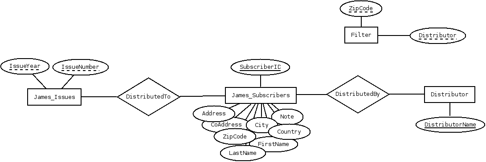

james
=====

James is a software used to manage lists of subscribers of the newspaper 
Götheborgske Spionen. 

Götheborgske Spionen is a newspaper that is distributed to all students and
employees at the university of gothenburg 8 times a year. Before each issue
is released, information about the subscribers are collected from different
sources and sent to the distributors. James keeps track of which distributor
should handle which subscribers.

Dependencies
============
James depends on third party software to function properly.
The following are used:
* Apache POI (>= 3.10.1) (for reading/writing XLS files)
* SuperCSV (>= 2.2.0) (for reading/writing CSV/TXT files)
* Apache Commons Net (>= 3.3)
* SQLite-JDBC (>= 3.8.7)

Development
===========
To work on development of this project, clone this git repository, and make 
sure you have all the dependencies added to your classpath. The main method
is in org.spionen.james/Main.java

Architecture
============
James uses a SQLite database to hold all data needed to work. See 
James-dbstructure.dia for an Entity-Relation diagram of the database.
As much as possible, the application adheres to the MVC model. Subscribers
can be decorated, which is used to do string formatting.

Licensing
=========
James is licensed under GPLv3, see LICENSE. All third party software packages
mentioned above are licensed under the Apache License v2.0.

The included file SQLScriptRunner.java is a modified version of a file
included in the iBATIS Apache project, and is also covered by the Apache
License v2.0.
